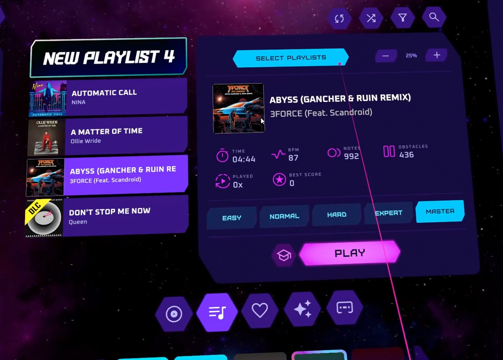
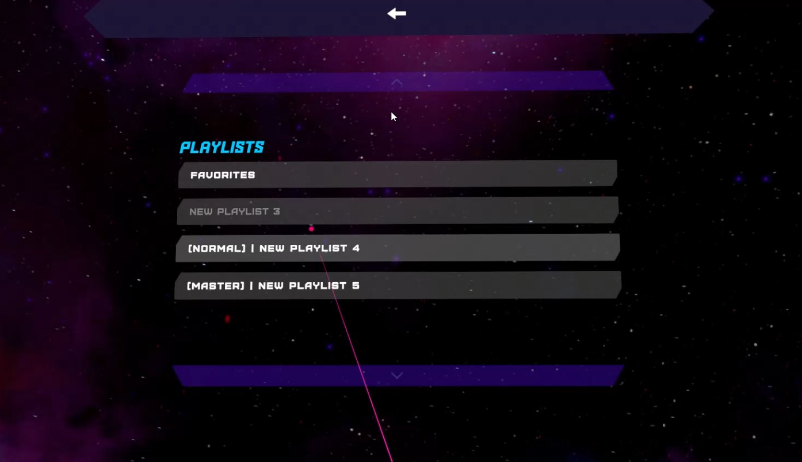

# SRPlaylistManager
A Synth Riders mod for better in-game management of playlists.

## Requirements
- PCVR (Steam) version of Synth Riders. No modding support for standalone Oculus yet :/ I've mainly tested on Oculus Quest 2 through Oculus Link.

## Installing
1. Prepare Synth Riders for modding by following the [MelonLoader](https://melonwiki.xyz/#/README) wiki guide
2. Download the newest version of SRPlaylistManager from the Releases section. Your web browser may warn you about the .zip file because it contains a .dll - this is normal, and is how mods are built. Save the zip file.
3. Extract the contents of the .zip file to  `<path-to-synth-riders>\Mods` (create a new directory if it doesn't exist). On Windows, this will be at `C:\Program Files (x86)\Steam\steamapps\common\SynthRiders\Mods`
4. Run Synth Riders and enjoy!

## Known Issues
- If you remove a song from the currently selected playlist and then add it back in before exiting the menu, the song will be added to the bottom of the playlist (it handles the remove and add while you are in the selection view instead of waiting until you exit).

## Next Up
- Multiplayer support
- Possibly an interface to change song order in playlist

## Development
Feel free to extend this as you want. Open issues for bugs and feature requests, and open PRs if you implement some of those yourself. I will try to respond in a timely manner :)

## Issues
If issues arise, add an Issue to this repository or ping me on Discord.

---

### Disclaimer
This mod is not affiliated with Synth Riders or Kluge Interactive. Use at your own risk.
